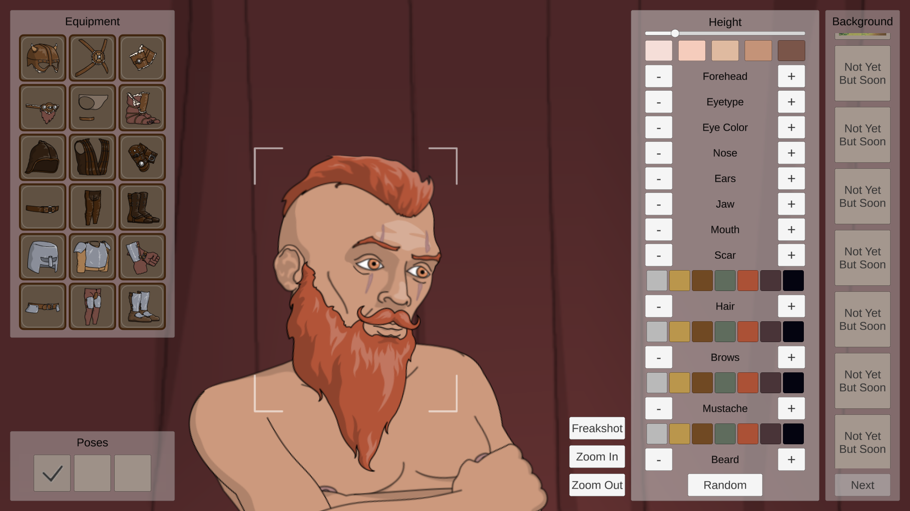
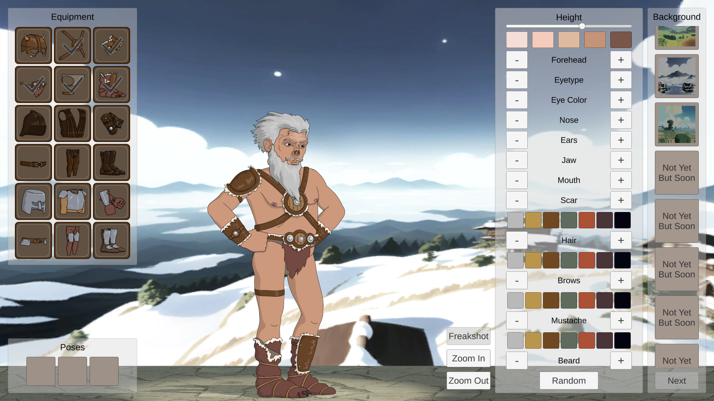
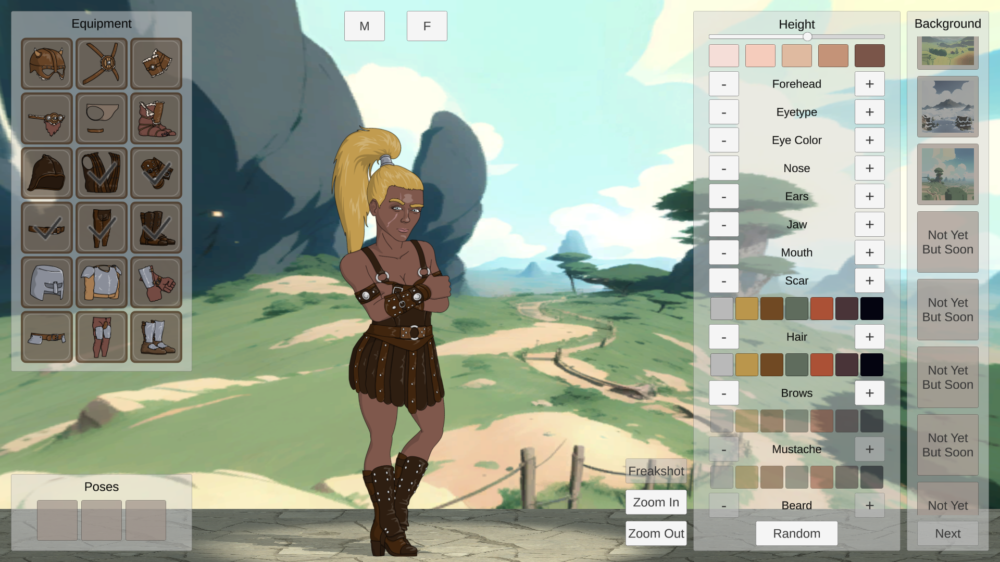

# 👤 Freaker - Create Your Freak

**Freaker** - это десктопное приложение для создания персонажей, созданное на Unity с использованием Spine. Позволяет создавать, редактировать и сохранять портреты персонажей.

## ✨ Возможности

### 🧑 Выбор пола
- Выбор между мужчиной (М) и женщиной (F)

### 💇 Настройка внешности
- Настройка роста, формы лба, век, носа, ушей, челюсти и рта
- Выбор цвета кожи, глаз, волос, бровей, усов и бороды(только для мужчин)
- Добавление шрамов

### 🔄 Случайный персонаж
- Выбор случайных параметров внешности

### 👗 Выбор экипировки
- Выбор из трех комплектов, в каждом по 6 предметов: шлем, нагрудник, наручи, пояс, поножи и обувь

### 💪 Выбор позы
- Выбор из трех поз, не считая начальную

### 🏞️ Выбор заднего фона
- Выбор из трех фонов

### 📸 Сохранение результата
- Сохранение портрета персонажа в формате png

## 🖥️ Системные требования

- **Unity** 2021.3.27f1
- **Spine-Unity** 3.8
- **ОС:** Windows 10 (64-bit)
- **Процессор:** x64 с поддержкой SSE2
- **ОЗУ:** 4 GB
- **Видеокарта:** с поддержкой DirectX 10
- **Место на диске:** 200 MB

## 📦 Установка

### 1. Установите Unity Hub и редактор
Скачайте **Unity Hub** с [официального сайта](https://unity.com/ru/download). Во время установки через Hub вам потребуется установить сам редактор версии:
2021.3.27f1

### 2. Клонирование репозитория
Скачайте ZIP-архив с главной страницы репозитория (кнопка <> Code)

### 3. Откройте проект
- Запустите Unity Hub.
- Нажмите кнопку Open (Открыть) -> Add project from disk (Добавить проект с диска).
- Укажите папку, куда вы склонировали репозиторий.
- Дождитесь завершения импорта (Unity пересоберет метафайлы).

### 4. Запуск приложения
- Чтобы запустить проект в редакторе, нажмите кнопку Play в Unity.

## 📄 Лицензия

Этот проект распространяется под лицензией MIT. Подробности в файле LICENSE.

## 📸 Скриншоты

